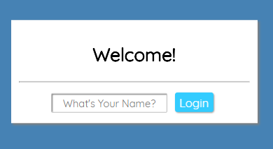
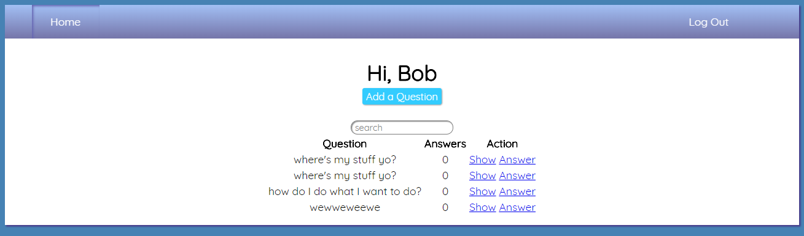

# Questions and Answers

Questions and Answers was originally built as a final exam to test understanding and compentency for the MEAN stack at Coding Dojo. 
We were given a wireframe that utilized CRUD functionality and 4.5 hours to complete it. 

## Updates
Since the final, which I passed with an 87%, I have worked on fixing logical errors, security flaws and showcasing a fundamental of CSS instead of relying on bootstrap or materalize. Even though these technologies make styling easier its important to understand what is going on under the hood and have a good command of CSS. 

## Future Goals
I plan on changing the styling and the usability to be more reminiscient of something like Reddit. 

### Login

simple name entry, will be updated to include a password field, as one was not required for the exam. 

### Dashboard

After successfully logging in the user will land on the dashboard where they can see the most recently asked questions. They can either answer a question or ask their own. 

### Answer
Under construction, check back soon. 

### Question
Under construction, check back soon.

### New Question
Under construction, check back soon.